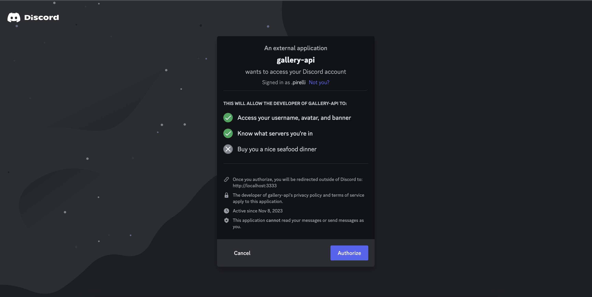
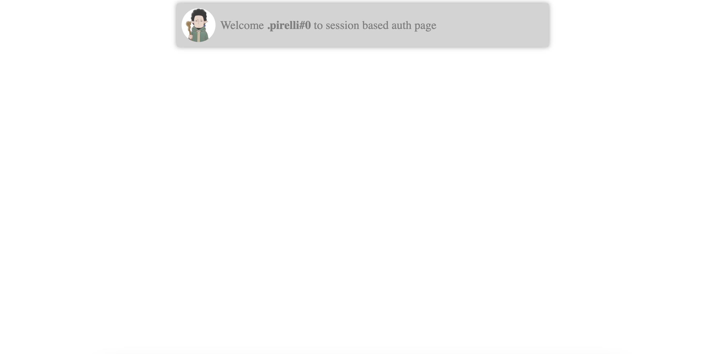
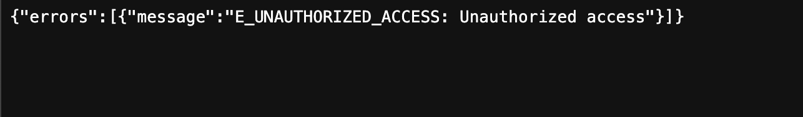

## Návod na spustenie

### 1. Prostredie
- Vo svojom počítači potrebuješ mať nainštalované prostredie **Node.js**
- Verzia Node.js musí byť aspoň **v14**. Zistíš ju príkazom ```node -v ```
  

### 2. Inštalácia
- Otvor si terminál a choď do root priečinka **gallery-api** ```cd gallery-api```
- Nainštaluj si potrebné **node_modules** spustením príkazu ```npm install```
  

### 3. Spustenie
- Projekt spustíš príkazom ```npm run dev``` a počkáš nabehne. Ak v terminály uvidíš hlášku ```started server on 0.0.0.0:3333```, tak to znamená, že projekt je spustený a funguje


## Popis riešenia
Potrebné API endopointy by mali fungovať podľa priloženej dokumentácie v zadaní. Ja som to testoval cez appku [Postman](https://www.postman.com/) ale aj cez browser. 

**.env** súbor by sa na GitHub nemal dávať už vôbec nie na public projekt, ale schválne som tam neuložil žiadne citlivé informácie. Discord client je len testovací. 

Navyše som doprogramoval nový API endopoint na vyhľadávanie obrázkov podľa mena pomocou ```searchValue```. 

Príklad použitia:

**Request**
```http://localhost:3333/images?searchValue=dog```

**Response**
```json
{
    "images": [
        {
            "path": "dog2.jpg",
            "fullPath": "Animals/dog2.jpg",
            "name": "dog2",
            "modified": "Thu Nov 09 2023 19:21:34 GMT+0100 (Central European Standard Time)"
        },
        {
            "path": "dog3.jpg",
            "fullPath": "Animals/dog3.jpg",
            "name": "dog3",
            "modified": "Thu Nov 09 2023 19:22:06 GMT+0100 (Central European Standard Time)"
        }
    ]
}
```

Ďalej som doprogramoval Discord OAuth2. Autentikácia je tentokrát session based. Na demonštráciu ukážky a jednoduchosti som pripravil jednoduchú front-end stránku, ktorá je zabezpečená autorizovaním requestom a vykreslí nejaké dáta z Discordu.

**Postup:**
1. Do prehliadača zadám adresu: http://localhost:3333/auth/discord/
2. Otvorí sa mi UI Discord klient s login. Viď fotka
3. Po autorizovaní ma hodí na spomínanú stránku  http://localhost:3333/auth/sec
4. Ak sa zmažem cookies alebo sa skusim na stránku dostať inak tak mi odmietne prístup

Bonusovú úlohu sa mi nepodarilo spraviť. Skončil som hneď na pri pokuse si opýtať URL, odmietlo mi to s tým, že appka je už neplátaná. Čiže niečo s client_id v administrácii.
##Návod na spustenie

### 1. Prostredie
- Vo svojom počítači potrebuješ mať nainštalované prostredie **Node.js**
- Verzia Node.js musí byť aspoň **v14**. Zistíš ju príkazom ```node -v ```
  

### 2. Inštalácia
- Otvor si terminál a choď do root priečinka **gallery-api** ```cd gallery-api```
- Nainštaluj si potrebné **node_modules** spustením príkazu ```npm install```
  

### 3. Spustenie
- Projekt spustíš príkazom ```npm run dev``` a počkáš nabehne. Ak v terminály uvidíš hlášku ```started server on 0.0.0.0:3333```, tak to znamená, že projekt je spustený a funguje


## Popis riešenia
Potrebné API endopointy by mali fungovať podľa priloženej dokumentácie v zadaní. Ja som to testoval cez appku [Postman](https://www.postman.com/) ale aj cez browser. 

**.env** súbor by sa na GitHub nemal dávať už vôbec nie na public projekt, ale schválne som tam neuložil žiadne citlivé informácie. Discord client je len testovací. 

Navyše som doprogramoval nový API endopoint na vyhľadávanie obrázkov podľa mena pomocou ```searchValue```. 

Príklad použitia:

**Request**
```http://localhost:3333/images?searchValue=dog```

**Response**
```json
{
    "images": [
        {
            "path": "dog2.jpg",
            "fullPath": "Animals/dog2.jpg",
            "name": "dog2",
            "modified": "Thu Nov 09 2023 19:21:34 GMT+0100 (Central European Standard Time)"
        },
        {
            "path": "dog3.jpg",
            "fullPath": "Animals/dog3.jpg",
            "name": "dog3",
            "modified": "Thu Nov 09 2023 19:22:06 GMT+0100 (Central European Standard Time)"
        }
    ]
}
```

Ďalej som doprogramoval Discord OAuth2. Autentikácia je tentokrát session based. Na demonštráciu ukážky a jednoduchosti som pripravil jednoduchú front-end stránku, ktorá je zabezpečená autorizovaním requestom a vykreslí nejaké dáta z Discordu.

**Postup:**
1. Do prehliadača zadám adresu: http://localhost:3333/auth/discord/
2. Otvorí sa mi UI Discord klient s login. Viď fotka
3. Po autorizovaní ma hodí na spomínanú stránku  http://localhost:3333/auth/sec
4. Ak sa zmažem cookies alebo sa skusim na stránku dostať inak tak mi odmietne prístup





Bonusovú úlohu sa mi nepodarilo spraviť. Skončil som hneď na pri pokuse si opýtať URL, odmietlo mi to s tým, že appka je už neplátaná. Čiže niečo s client_id v administrácii.
